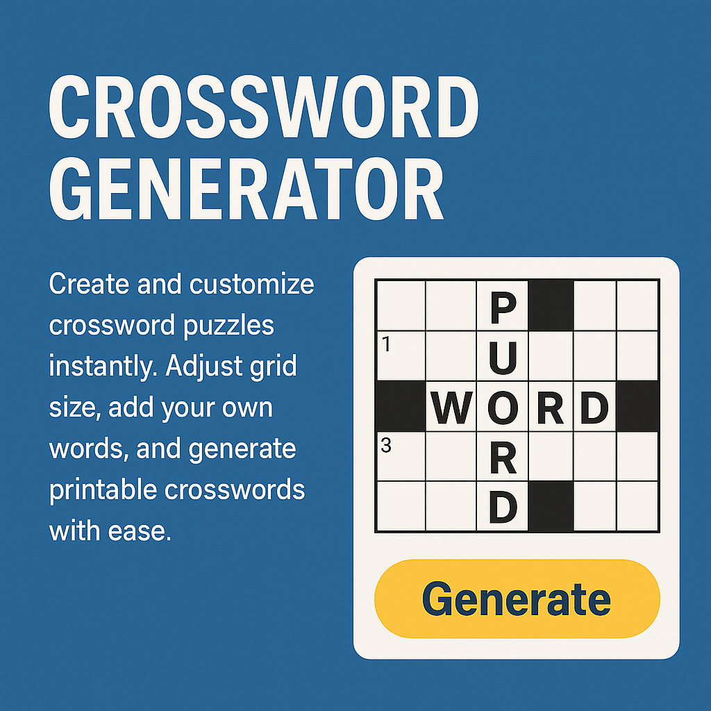

# Crossword React App — Open‑Source Crossword Puzzle Generator (React + TypeScript)

Create, generate, and preview crossword puzzles online. This project is a fast, responsive crossword app built with React, TypeScript, Vite, Material UI, Redux Toolkit, and i18next. Manage your own word lists, toggle light/dark mode, and view the generated crossword grid instantly.

- Live Demo: https://bitlogicforge.github.io/crossword
- Homepage: https://bitlogicforge.github.io/crossword



## Features

- Crossword puzzle generator: place user-provided words into a grid
- Word list management: add/remove words dynamically
- “Can’t place” indicator for problematic words
- Optional filled grid (random letters in empty cells)
- Multilingual UI (i18n): EN, DE, ES, FR, IT, PL, RU
- Responsive UI with Material UI, mobile-friendly layout
- Theme toggle: light/dark mode
- Open source, fast build with Vite

## Why this project

- Free and open source crossword maker for the web
- Built with a modern React + TypeScript stack
- Simple, no-backend architecture suitable for static hosting (GitHub Pages)

## Getting Started

1) Install dependencies:
```bash
npm install
```
2) Start the development server:
```bash
npm run dev
```
3) Build for production:
```bash
npm run build
```

## Tech Stack

- React, TypeScript, Vite
- Material UI (MUI)
- Redux Toolkit (RTK) for state management
- i18next for internationalization
- Framer Motion for subtle animations

## Internationalization

The UI supports multiple languages out of the box:
- English, German, Spanish, French, Italian, Polish, Russian

## SEO Keywords & Phrases

- crossword generator, crossword puzzle generator, open source crossword app
- create crossword online, free crossword maker, build crossword from word list
- react crossword, typescript crossword, material ui crossword
- word list management, multilingual crossword, i18n crossword app
- responsive crossword grid, dark mode crossword, browser-based crossword
- github pages crossword, vite react crossword

## Roadmap

See INNOVATIONS.md for detailed product ideas and technical enhancements, including better puzzle generation (scoring/backtracking), clues and numbering, keyboard play mode, import/export, shareable seeds, accessibility, and more.

## Contributing

Contributions are welcome. Please open an issue or PR with your proposal.

## License

MIT
